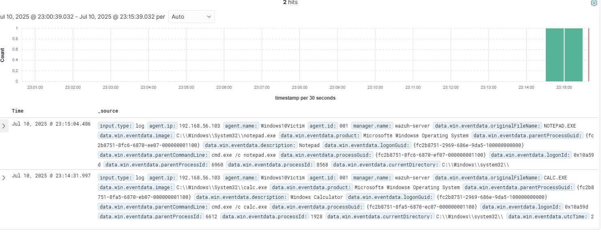

# Sysmon Event ID 1 - Process Creation (Parent-Child Chain)

## Simulation
Command: `cmd.exe /c notepad.exe`  
Command: `cmd.exe /c calc.exe`

## What Happened
- Parent: cmd.exe
- Children: notepad.exe, calc.exe
- User: [Your VM user]
- Timestamp: [use your screenshot time]

## Detection Notes
- Event ID: 1
- Useful fields: process.name, process.command_line, parent_process.name
- Observed in: Kibana → Discover → `data.win.system.eventID: 1`

## Screenshot

